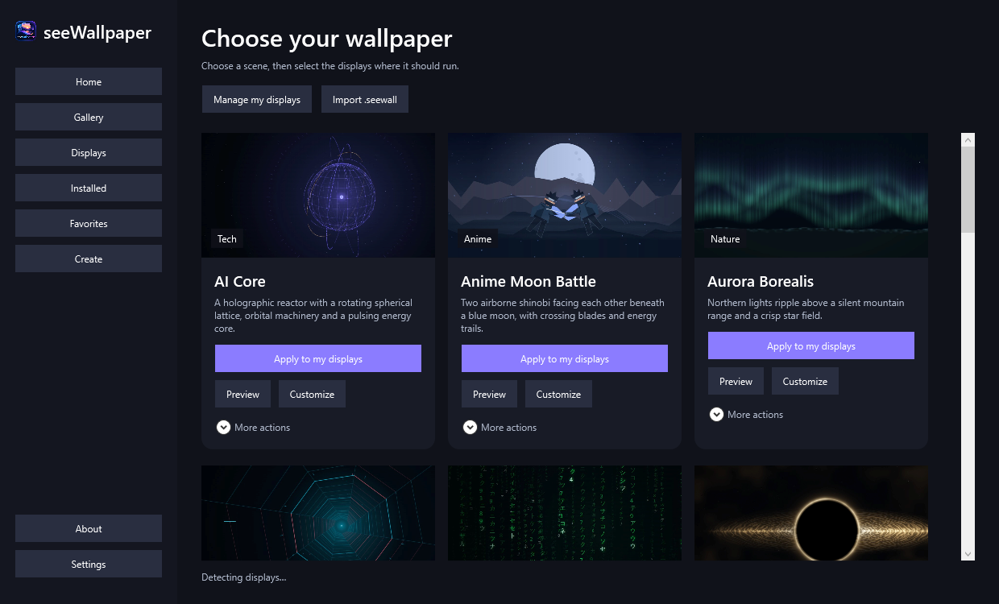
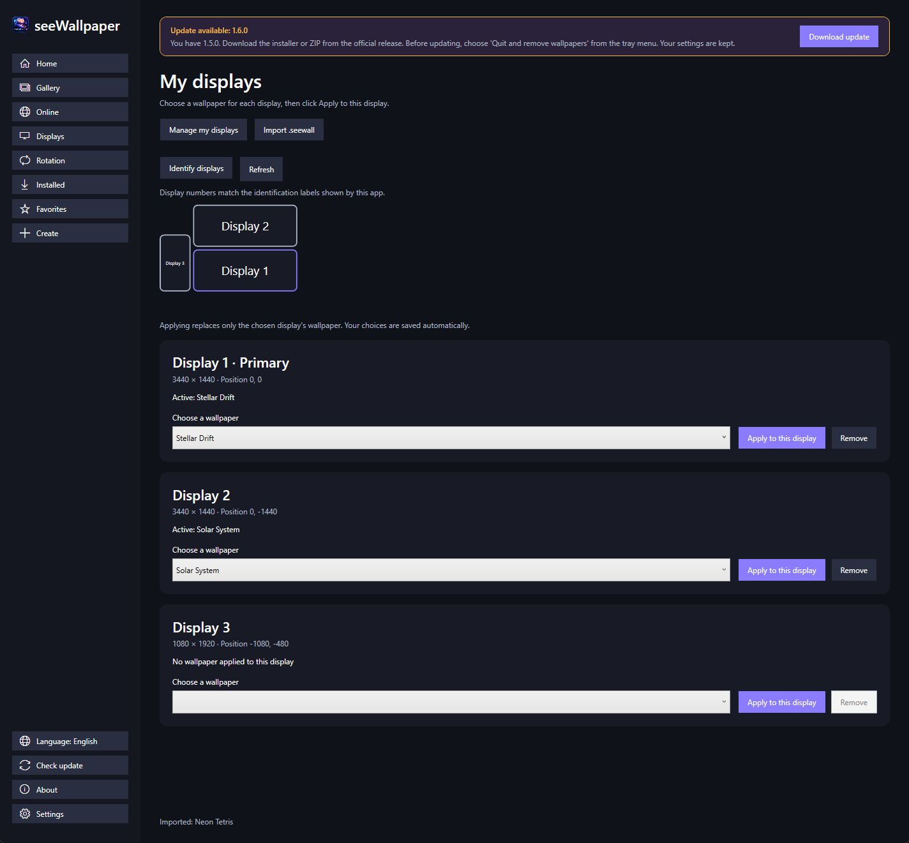

<p align="center">
  
</p>
<h1 align="center">seeWallpaper</h1>
<p align="center"><strong>Animated scenes. Your displays. Your atmosphere.</strong><br />A Windows application created by <strong>Michael Ruffenach</strong>.</p>
<p align="center">
  <a href="https://github.com/Hytachi182/seeWallpapers/actions/workflows/ci.yml"></a>
  <a href="https://github.com/Hytachi182/seeWallpapers/releases/latest"></a>
  <a href="https://github.com/Hytachi182/seeWallpapers/releases"></a>
  <a href="LICENSE"></a>
  
  <a href="https://github.com/Hytachi182/seeWallpapers/stargazers"></a>
</p>
<p align="center">
  <a href="https://github.com/Hytachi182/seeWallpapers/releases/latest/download/seeWallpaper-Setup-x64.exe"></a>
  <a href="https://github.com/Hytachi182/seeWallpapers/releases/latest/download/seeWallpaper-Portable-x64.zip"></a>
</p>
<p align="center">
  <a href="#get-started">Get started</a> · <a href="#features">Features</a> · <a href="#the-scenes">Previews</a> · <a href="docs/template-format.md">SDK</a> · <a href="CHANGELOG.md">Changelog</a> · <a href="https://github.com/Hytachi182/seeWallpapers/issues/new/choose">Report an issue</a>
</p>



## Get started

The download buttons always point to the **latest stable release**, with no GitHub account required. Find all versions and their checksums in [Releases](https://github.com/Hytachi182/seeWallpapers/releases).

| Distribution | Best for | Getting started |
| --- | --- | --- |
| **[Windows installer](https://github.com/Hytachi182/seeWallpapers/releases/latest/download/seeWallpaper-Setup-x64.exe)** | Shortcuts and Windows integration | Open the EXE, choose your options, and launch the app. |
| **[Portable ZIP](https://github.com/Hytachi182/seeWallpapers/releases/latest/download/seeWallpaper-Portable-x64.zip)** | Launching after extraction | **Extract all**, then open **Launch seeWallpaper.cmd** in the extracted folder. |
| **[SHA-256 checksums](https://github.com/Hytachi182/seeWallpapers/releases/latest/download/SHA256SUMS.txt)** | Checking downloaded files | Compare the checksum with `Get-FileHash -Algorithm SHA256`. |

**Requirements:** Windows 10 version 2004 or later, or Windows 11, 64-bit. .NET is included. The ZIP launcher and installer check WebView2; installing it initially requires Internet if it is missing. Built-in scenes then run offline.

**Updating:** close the previous app before installing or extracting the new version. Personal scenes and settings remain in `%LocalAppData%\seeWallpaper`, shared by the portable and installed editions.

> The app and installer are not yet signed with a publisher certificate. Download files from this repository's Releases. The included WebView2 bootstrapper has a Microsoft signature verified during the build.

[Installer guide](docs/windows-installer.md) · [ZIP guide](docs/windows-portable.md)

## Features

| | Available today |
| --- | --- |
| **Your scene, your display** | Apply to one or more monitors, with a different scene on each display. |
| **Visual identification** | View the monitor layout and identify displays before applying. |
| **Duplicate or span** | Use the same wallpaper everywhere or span it across the entire desktop. |
| **Customize** | Preview scenes, adjust their settings, and save favorites. |
| **Share** | Import, export, and duplicate `.seewall` packages. |
| **Tune performance** | Choose a performance profile and configure fullscreen or battery pauses; wallpapers pause when the session locks. |
| **Restore your desktop** | Restore saved assignments when the app starts. |
| **Windows integration** | Shortcuts, desktop context menu, `.seewall` opening, optional sign-in startup, and uninstall. |

<details>
<summary><strong>See display management</strong></summary>



Choose **Apply to my displays**, select your monitors, and click **Apply**. The **Displays** page also lets you choose, replace, or remove a wallpaper on a single monitor.

Numbers match the app's identification labels. **Duplicate** and **Span** replace all instances. Applying to one display after spanning restores independent assignments.

</details>

## The scenes

Eighteen procedural wallpapers are included. The images below are captured from the actual scenes.

**New Anime collection:** five original scenes with adjustable energy color, animation speed, and atmosphere intensity. They work offline and can be assigned independently to your displays.

| Ninja Anime | Hidden Village |
| --- | --- |
|  |  |
| Shinobi Energy | Orange Ninja |
|  |  |
| Anime Moon Battle | |
|  | |

| Aurora Borealis | Ocean Dusk |
| --- | --- |
|  |  |
| Sakura Night | Event Horizon |
|  |  |

Also included: **Moonlit Dunes**, **Firefly Grove**, **Spectral Forge**, **Digital Rain 3D**, **Data Tunnel**, **Rainy Window**, **AI Core**, **Neural Network**, and **Operations Center**. The last displays CPU, memory, battery, and uptime measurements received from the system.

[Explore the scenes and rendering tools](docs/template-artwork.md)

## Create a wallpaper

A scene is a self-contained folder with a `manifest.json`, an HTML page, its assets, and a preview. The SDK exposes settings, documented system information, pause/resume, and the performance profile. Imports validate the manifest, paths, and package limits.

- [Template format and SDK](docs/template-format.md)
- [Engine and Windows desktop integration](docs/wallpaper-engine.md)
- [Import, export, and examples](templates)

A visual template editor is planned; scenes are currently created using the SDK and template files.

## Develop

Requirements: Windows and the .NET 8 SDK. Inno Setup 6 is needed to build the installer. Node.js and Playwright are only used by scene generation and capture tools.

```powershell
git clone https://github.com/Hytachi182/seeWallpapers.git
cd seeWallpapers
dotnet restore seeWallpaper.sln
dotnet build seeWallpaper.sln
dotnet test seeWallpaper.sln
dotnet run --project src/SeeWallpaper.App
```

To build distributions:

```powershell
.\build\build-installer.ps1
.\build\build-portable.ps1
.\build\prepare-release.ps1
```

The **CI** workflow builds and tests every push and pull request. **Windows release** builds and verifies both distributions; a `vX.Y.Z` tag matching the app version automatically publishes the assets. A manual run produces build artifacts without publishing a release. [Release procedure](docs/releasing.md).

<details>
<summary><strong>Architecture and validation</strong></summary>

| Project | Responsibility |
| --- | --- |
| `SeeWallpaper.App` | WPF interface and application composition |
| `SeeWallpaper.Core` | Contracts and models |
| `SeeWallpaper.TemplateEngine` | Catalog, validation, library, and packages |
| `SeeWallpaper.Engine` | WebView2, windows, and wallpaper lifecycle |
| `SeeWallpaper.System` | Displays and system measurements |
| `SeeWallpaper.Infrastructure` | Local configuration and logging |

The 1.2.0 baseline passed **22 .NET tests**, **23 installer checks**, and **28 ZIP checks** locally. Real loading was also verified on three monitors, including replacement, duplication, spanning, and DPI-context changes. Interactive desktop tests require `SEEWALLPAPER_DESKTOP_TEST=1` and do not run on CI runners. The 1.2.1 public release also passed the GitHub packaging workflow.

The English **1.3.0** edition passed **22 local .NET tests**, **25 installer checks**, and **28 ZIP checks**, including legacy shortcut cleanup and the English launcher filenames. Its screenshots were captured from the translated WPF interface.

The **1.4.0** Anime edition passed **27 local .NET tests**, **25 installer checks**, and **33 ZIP checks**. All five new scenes passed desktop/narrow rendering, customization, and pause/resume checks. Ninja Anime was also loaded on three real monitors, including replacement, duplication, spanning, and DPI-context changes.

Known limits: automatic reconciliation after disconnecting a display is still planned; WebView2 installation on a Windows machine entirely without that runtime still needs clean-machine validation. GPU performance depends on hardware and the number of active scenes.

</details>

## Contribute

Have a scene idea or an improvement? [Request a feature](https://github.com/Hytachi182/seeWallpapers/issues/new/choose), [report a bug](https://github.com/Hytachi182/seeWallpapers/issues/new/choose), or read the [contribution guide](CONTRIBUTING.md).

If you enjoy seeWallpaper, a [star on GitHub](https://github.com/Hytachi182/seeWallpapers/stargazers) helps others discover the project.

## Creator and license

**Designed and created by Michael Ruffenach.** This credit is also displayed on the app's **About** page.

Distributed under the [MIT license](LICENSE). Contributions are welcome under the [code of conduct](CODE_OF_CONDUCT.md). For a vulnerability, use [private reporting](https://github.com/Hytachi182/seeWallpapers/security/advisories/new) and read the [security policy](SECURITY.md).
