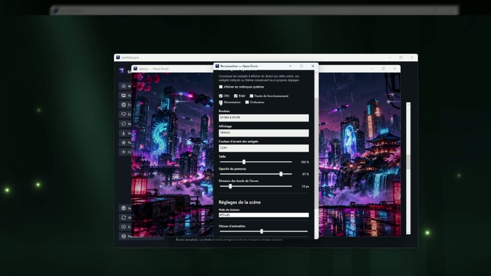

<p align="center">
  
</p>
<h1 align="center">seeWallpaper</h1>
<p align="center"><strong>Animated scenes. Your displays. Your atmosphere.</strong><br />A Windows application created by <strong>Michael Ruffenach</strong>.</p>
<p align="center">
  <a href="https://github.com/Hytachi182/seeWallpapers/actions/workflows/ci.yml"></a>
  <a href="https://github.com/Hytachi182/seeWallpapers/releases/latest"></a>
  <a href="https://github.com/Hytachi182/seeWallpapers/releases"></a>
  <a href="LICENSE"></a>
  
  <a href="https://github.com/Hytachi182/seeWallpapers/stargazers"></a>
</p>
<p align="center">
  <a href="https://github.com/Hytachi182/seeWallpapers/releases/latest/download/seeWallpaper-Setup-x64.exe"></a>
  <a href="https://github.com/Hytachi182/seeWallpapers/releases/latest/download/seeWallpaper-Portable-x64.zip"></a>
</p>
<p align="center">
  <a href="https://buymeacoffee.com/hytachi182"></a>
</p>
<p align="center">
  <a href="#get-started">Get started</a> · <a href="#features">Features</a> · <a href="#the-scenes">Previews</a> · <a href="docs/template-format.md">SDK</a> · <a href="CHANGELOG.md">Changelog</a> · <a href="https://github.com/Hytachi182/seeWallpapers/issues/new/choose">Report an issue</a>
</p>


## Watch the demo

[](docs/videos/seeWallpaper.mp4)

[Watch or download the full video](docs/videos/seeWallpaper.mp4) (2 min 3 sec, 1080p). Click the preview to open the MP4.

## Get started

**System metrics (unreleased):** open a scene's **Customize** window and enable **System metrics**. Choose CPU, RAM, uptime, power and computer name, then adjust position, values/gauges/history graphs, color, size, panel opacity and edge spacing. Changes appear in the preview and on displays already using that scene, and are saved per scene. Theme-specific widgets retain their own controls. Network, disk, GPU and temperature collectors are not included yet.

<!-- release-info:start -->
Source version: **1.9.0**. Download buttons follow the latest published stable release. A newer source version becomes available for download only after its Windows packages are published.
<!-- release-info:end -->

The download buttons always point to the **latest stable release**, with no GitHub account required. Find all versions and their checksums in [Releases](https://github.com/Hytachi182/seeWallpapers/releases).

| Distribution | Best for | Getting started |
| --- | --- | --- |
| **[Windows installer](https://github.com/Hytachi182/seeWallpapers/releases/latest/download/seeWallpaper-Setup-x64.exe)** | Shortcuts and Windows integration | Open the EXE, choose your options, and launch the app. |
| **[Portable ZIP](https://github.com/Hytachi182/seeWallpapers/releases/latest/download/seeWallpaper-Portable-x64.zip)** | Launching after extraction | **Extract all**, then open **Launch seeWallpaper.cmd** in the extracted folder. |
| **[SHA-256 checksums](https://github.com/Hytachi182/seeWallpapers/releases/latest/download/SHA256SUMS.txt)** | Checking downloaded files | Compare the checksum with `Get-FileHash -Algorithm SHA256`. |

**Requirements:** Windows 10 version 2004 or later, or Windows 11, 64-bit. .NET is included. The ZIP launcher and installer check WebView2; installing it initially requires Internet if it is missing. Built-in scenes then run offline.

**Updating:** quit the previous app (right-click its notification area icon, then **Quit and remove wallpapers**) before installing or extracting the new version. Personal scenes and settings remain in `%LocalAppData%\seeWallpaper`, shared by the portable and installed editions.

**Automatic updates (unreleased):** choose **Check update**, then **Install and restart**. The app downloads the package for your installed or portable edition, shows progress, verifies SHA-256, closes, installs and restarts automatically. You can cancel before installation. The first version containing this feature must be installed manually once. See [Application updates](docs/application-updates.md).

**Language (unreleased):** use the **Language** button near Settings to switch immediately between **Français**, **English**, **Deutsch**, **Español**, **Lëtzebuergesch**, **Română**, **Polski** and **Italiano**. The app remembers your choice in `%LocalAppData%\seeWallpaper\language.json`, including after a Windows restart. On first launch it follows the Windows UI language when supported, otherwise English. Switching languages keeps your page and wallpapers active.

> The app and installer are not yet signed with a publisher certificate. Download files from this repository's Releases. The included WebView2 bootstrapper has a Microsoft signature verified during the build.

[Installer guide](docs/windows-installer.md) · [ZIP guide](docs/windows-portable.md)

## Features

| | Available today |
| --- | --- |
| **Your scene, your display** | Apply to one or more monitors, with a different scene on each display. |
| **Visual identification** | View the monitor layout and identify displays before applying. |
| **Duplicate or span** | Use the same wallpaper everywhere or span it across the entire desktop. |
| **Customize** | Preview scenes, adjust their settings, and save favorites. |
| **New scenes online** | The **Online** page offers wallpapers newly published on GitHub and updates to installed ones, verified before installation. |
| **Share** | Import, export, and duplicate `.seewall` packages. |
| **Tune performance** | Choose a performance profile and configure fullscreen or battery pauses; wallpapers pause when the session locks. |
| **Runs in the background** | Closing the window keeps wallpapers running from the notification area; right-click the icon to quit. |
| **Restore your desktop** | Restore saved assignments when the app starts. |
| **Windows integration** | Shortcuts, desktop context menu, `.seewall` opening, optional sign-in startup, and uninstall. |

<details>
<summary><strong>See display management</strong></summary>


Choose **Apply to my displays**, select your monitors, and click **Apply**. The **Displays** page also lets you choose, replace, or remove a wallpaper on a single monitor.

Numbers match the app's identification labels. **Duplicate** and **Span** replace all instances. Applying to one display after spanning restores independent assignments.

</details>

## The scenes

<!-- template-summary:start -->
**50 wallpapers are included.** Browse the [complete catalogue](docs/template-catalogue.md) for scene names, previews, creators, and versions.
<!-- template-summary:end -->

**New Anime collection:** five original scenes with adjustable energy color, animation speed, and atmosphere intensity. They work offline and can be assigned independently to your displays.

| Ninja Anime | Hidden Village |
| --- | --- |
|  |  |
| Shinobi Energy | Orange Ninja |
|  |  |
| Anime Moon Battle | Crimson Valley |
|  |  |

| Pure Cosmos | Lunar Silence |
| --- | --- |
|  |  |
| Solar System | Robot Workshop |
|  |  |
| Astral Frontier | Orbital Earth |
|  |  |
| Neon Ronin | Desert Wanderer |
|  |  |
| Pirate Cove | |
|  | |

| Aurora Borealis | Ocean Dusk |
| --- | --- |
|  |  |
| Sakura Night | Event Horizon |
|  |  |

Also included: **Moonlit Dunes**, **Firefly Grove**, **Spectral Forge**, **Digital Rain 3D**, **Data Tunnel**, **Rainy Window**, **AI Core**, **Neural Network**, and **Operations Center**. The last displays CPU, memory, battery, and uptime measurements received from the system.

[Explore the scenes and rendering tools](docs/template-artwork.md)

**Crystal Run** is an original self-playing pixel platform adventure: a survey robot jumps between floating ruins, collects crystals and reaches beacons across dawn, twilight and moonlight trails. [Theme details](docs/crystal-run.md).

**Orbital Defender** is an original self-playing retro space shooter with drone formations, dodging autopilot, destructible shields and escalating waves. [Theme details](docs/orbital-defender.md).

**Amber Maze** is an original self-playing maze chase with a lantern robot, collectible shards, patrolling sentinels, overcharge bonuses and freshly generated labyrinths. [Theme details](docs/amber-maze.md).

**Rooftop Rivals** is an original self-playing arcade robot fight with punches, kicks, guards, jumps, energy pulses and best-of-three matches on a rooftop at dusk. [Theme details](docs/rooftop-rivals.md).

**Neon Rally** is a self-playing retro paddle duel with predictive autopilots, spin, accelerating rallies, mint/coral lighting and first-to-seven matches. [Theme details](docs/neon-rally.md).

Seven more automatic pixel worlds are included: **Pixel Defender**, **Castle Raid**, **Tiny City**, **Dungeon Loop**, **Pixel Island**, **Robot Factory**, and **Tower Climber**. Watch drone battles, fortress raids, city life, dungeon exploration, island construction, robot production and endless climbing. [Theme details](docs/pixel-worlds.md).

**Rain on Glass** adds realistic water over an original city photograph: droplets settle, merge, refract the scenery and slide down the glass with fading wet trails. [Theme details](docs/rain-on-glass.md).

**Meteor Shower** brings a photographic Milky Way above a mountain lake, with automatic shooting stars, fine luminous trails, subtle scintillation and occasional brighter fireballs. [Theme details](docs/meteor-shower.md).

**War Front** animates the supplied battle illustration with drifting smoke, flickering fires and embers, distant tracers, jet exhaust, helicopter rotors and harbour reflections. The original soldiers stay fixed. [Theme details](docs/war-front.md).

**Particle Nexus** uses the bundled particles.js library for luminous drifting nodes, fine proximity links and optional pointer connections, with adjustable colors, density and speed. [Theme details](docs/particle-nexus.md).

**Winter Snowfall** adds photographic alpine winter scenery with three depths of animated snow, softly defocused nearby flakes and gentle directional wind. [Theme details](docs/winter-snowfall.md).

**Alpine Thunderstorm** brings photographic storm scenery with layered wind-driven rain, drifting haze, lake ripples and branching lightning illuminating the clouds and water. [Theme details](docs/alpine-thunderstorm.md).

**Underwater Blue** brings a living photographic reef with swimming tropical fish, animated tails, a distant shoal and rising bubble streams, alongside moving sunlight, seabed reflections and suspended particles. [Theme details](docs/underwater-blue.md).

## Create a wallpaper

A scene is a self-contained folder with a `manifest.json`, an HTML page, its assets, and a preview. The SDK exposes settings, documented system information, pause/resume, and the performance profile. Imports validate the manifest, paths, and package limits.

- [Template format and SDK](docs/template-format.md)
- [Engine and Windows desktop integration](docs/wallpaper-engine.md)
- [Import, export, and examples](templates)

A visual template editor is planned; scenes are currently created using the SDK and template files.

**Share your creation:** community wallpapers are welcome! [Submit your wallpaper](https://github.com/Hytachi182/seeWallpapers/issues/new?template=template_submission.yml) with a ZIP and a screenshot, directly in your browser. No Git or fork required. The maintainer reviews it before publication; once merged, it appears in the app's **Online** catalogue. Read the [creation and sharing guides](docs/wiki/Home.md), or follow the [pull request route](CONTRIBUTING.md#create-and-share-a-wallpaper).

<p align="center">
  <a href="https://github.com/Hytachi182/seeWallpapers/issues/new?template=template_submission.yml"></a>
  <a href="docs/wiki/Home.md"></a>
</p>

## Develop

Requirements: Windows and the .NET 8 SDK. Inno Setup 6 is needed to build the installer. Node.js and Playwright are only used by scene generation and capture tools.

```powershell
git clone https://github.com/Hytachi182/seeWallpapers.git
cd seeWallpapers
dotnet restore seeWallpaper.sln
dotnet build seeWallpaper.sln
dotnet test seeWallpaper.sln
dotnet run --project src/SeeWallpaper.App
```

To build distributions:

```powershell
.\build\build-installer.ps1
.\build\build-portable.ps1
.\build\prepare-release.ps1
```

The pipeline has three stages: **1 - Prepare version** on a push to `devops`, **2 - Validate changes** for the prepared commit and pull requests, and **3 - Publish Windows release** after merging your single **devops into main** PR. Version and release notes are automatic; Windows downloads appear after packaging succeeds. Each run includes a status summary. A manual Windows release run produces artifacts without publishing. [Release procedure](docs/releasing.md).

<details>
<summary><strong>Architecture and validation</strong></summary>

| Project | Responsibility |
| --- | --- |
| `SeeWallpaper.App` | WPF interface and application composition |
| `SeeWallpaper.Core` | Contracts and models |
| `SeeWallpaper.TemplateEngine` | Catalog, validation, library, and packages |
| `SeeWallpaper.Engine` | WebView2, windows, and wallpaper lifecycle |
| `SeeWallpaper.System` | Displays and system measurements |
| `SeeWallpaper.Infrastructure` | Local configuration and logging |

The 1.2.0 baseline passed **22 .NET tests**, **23 installer checks**, and **28 ZIP checks** locally. Real loading was also verified on three monitors, including replacement, duplication, spanning, and DPI-context changes. Interactive desktop tests require `SEEWALLPAPER_DESKTOP_TEST=1` and do not run on CI runners. The 1.2.1 public release also passed the GitHub packaging workflow.

The English **1.3.0** edition passed **22 local .NET tests**, **25 installer checks**, and **28 ZIP checks**, including legacy shortcut cleanup and the English launcher filenames. Its screenshots were captured from the translated WPF interface.

The **1.4.0** Anime edition passed **27 local .NET tests**, **25 installer checks**, and **33 ZIP checks**. All five new scenes passed desktop/narrow rendering, customization, and pause/resume checks. Ninja Anime was also loaded on three real monitors, including replacement, duplication, spanning, and DPI-context changes.

Since **1.5.0**, the application automatically reconciles displays when they connect, disconnect, or change geometry. Monitor assignments use the Windows monitor device interface. Upgrading from earlier independent assignments requires selecting each monitor's wallpaper once; changing ports or docks can also require a new selection. Personal scenes and customization remain available.

Known limits: physical unplug/replug and dock/port acceptance remains pending; WebView2 installation on a Windows machine entirely without that runtime still needs clean-machine validation. GPU performance depends on hardware and the number of active scenes.

</details>

## Contribute

Have a scene idea or an improvement? [Request a feature](https://github.com/Hytachi182/seeWallpapers/issues/new/choose), [report a bug](https://github.com/Hytachi182/seeWallpapers/issues/new/choose), or read the [contribution guide](CONTRIBUTING.md).

If you enjoy seeWallpaper, a [star on GitHub](https://github.com/Hytachi182/seeWallpapers/stargazers) helps others discover the project.

> ☕ **Enjoying seeWallpaper?** Help keep new scenes and improvements coming: [buy Michael a coffee](https://buymeacoffee.com/hytachi182).

## Creator and license

**Designed and created by Michael Ruffenach.** This credit is also displayed on the app's **About** page.

Distributed under the [MIT license](LICENSE). Contributions are welcome under the [code of conduct](CODE_OF_CONDUCT.md). For a vulnerability, use [private reporting](https://github.com/Hytachi182/seeWallpapers/security/advisories/new) and read the [security policy](SECURITY.md).
