# Wallpaper catalogue

**51 built-in wallpapers.** Generated from the scene manifests.

| Preview | Wallpaper | Category | Creator | Version |
| --- | --- | --- | --- | --- |
| 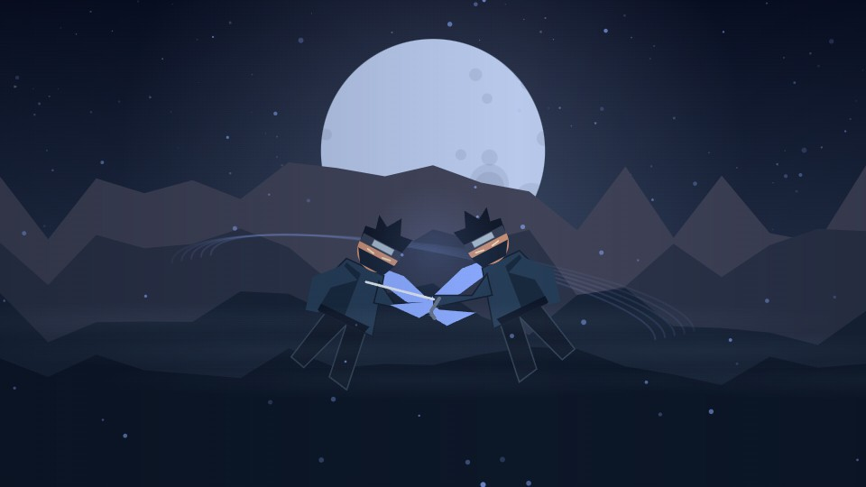 | **Anime Moon Battle** Two airborne shinobi facing each other beneath a blue moon, with crossing blades and energy trails. | Anime | seeWallpaper | 1.0.0 |
| 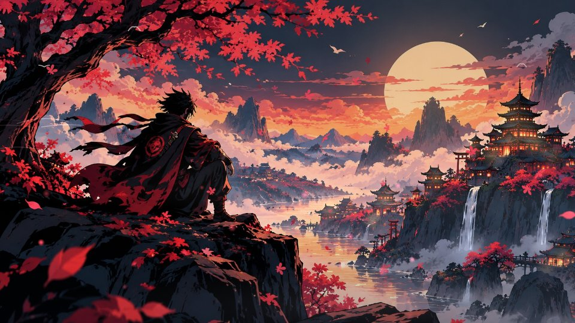 | **Crimson Valley** A lone warrior beneath a crimson maple overlooking a sunset valley, with falling leaves, flowing waterfalls, flickering pagoda lights and drifting mist. | Anime | seeWallpaper | 1.0.0 |
| 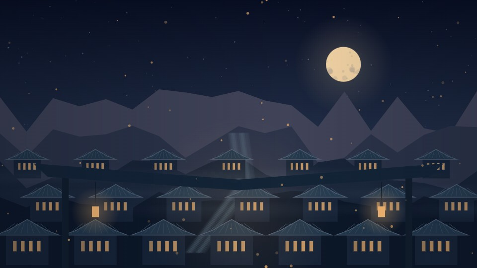 | **Hidden Village** A lantern-lit mountain village with tiled rooftops, waterfall mist and floating fireflies. | Anime | seeWallpaper | 1.0.0 |
| 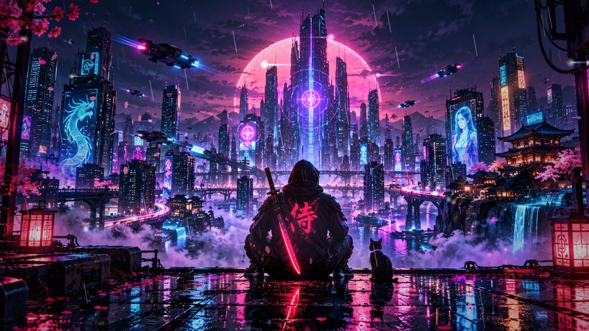 | **Neon Ronin** A hooded samurai and his cat watching a neon megacity at night, with rain and puddle ripples, flickering signs, a glowing katana, flying traffic, highway light trails, rotating targets, waterfalls, sakura petals and distant lightning. | Anime | seeWallpaper | 1.0.0 |
|  | **Ninja Anime** A masked rooftop guardian, flowing scarf, crimson moon and drifting cherry blossoms. | Anime | seeWallpaper | 1.0.0 |
|  | **Orange Ninja** An original orange-cloaked ninja overlooking a golden mountain valley, with wind-blown leaves. | Anime | seeWallpaper | 1.0.0 |
| 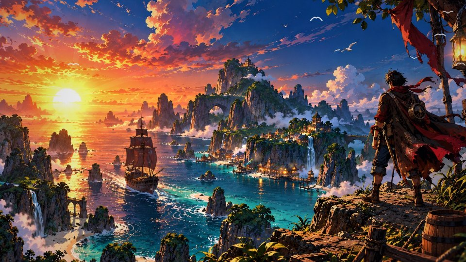 | **Pirate Cove** A young pirate overlooking a sunset cove, with gentle folds in the red banner, scarf and cloak, a flickering lantern, warm harbour lights, flowing waterfalls, sea reflections and distant gliding seagulls. | Anime | seeWallpaper | 1.0.1 |
|  | **Shinobi Energy** A standing shinobi surrounded by rotating energy seals, rising sparks and luminous ribbons. | Anime | seeWallpaper | 1.0.0 |
| 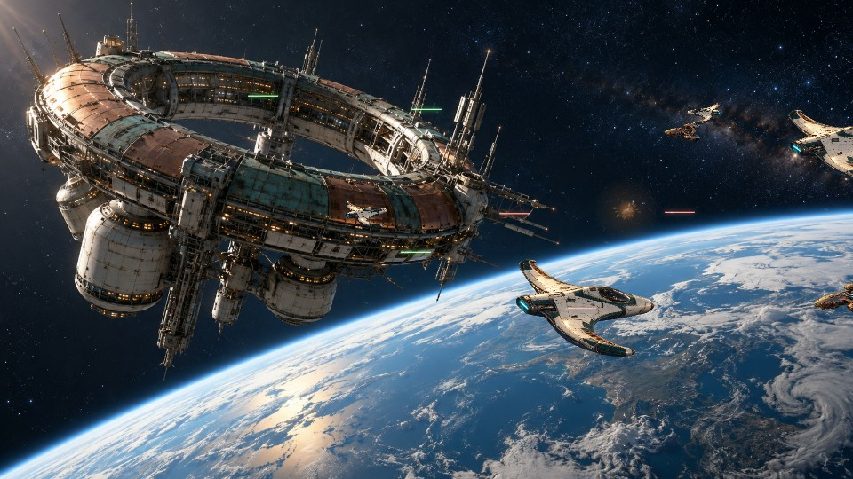 | **Galactic Battle** An original cinematic orbital battle above a blue planet. Nine curved-hull interceptors and asymmetric raiders cross the sky with ion-engine light, laser salvos, distant explosions and drifting debris around an immense ring-shaped cruiser. Generated artwork, entirely offline. | Cinematic | seeWallpaper | 1.1.0 |
|  | **War Front** A burning harbour at sunset brought to life with billowing smoke, animated flames, rising embers, frequent tracer salvos and distant city explosions. Pulsing jet exhaust, helicopter rotors and shimmering water complete the supplied illustration. Original soldiers remain stable; entirely offline. | Cinematic | seeWallpaper | 1.1.0 |
| 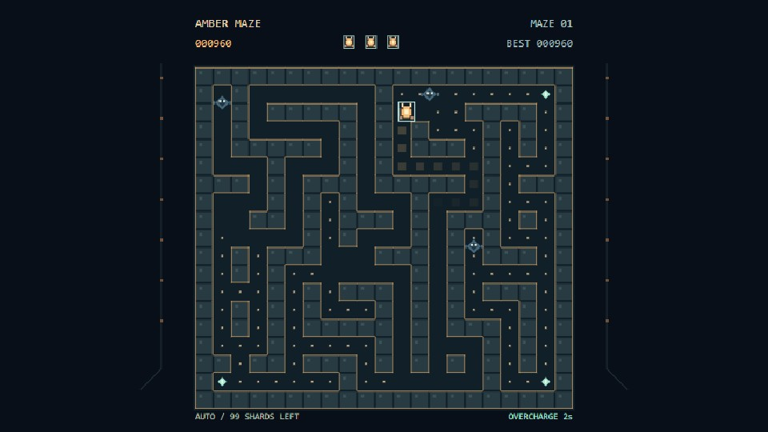 | **Amber Maze** An original self-playing maze chase. A lantern robot gathers shards through changing labyrinths, avoids angular sentinels and uses temporary overcharge to disable pursuers. Real scores, lives, new mazes and automatic restarts. Procedural pixel art, entirely offline. | Games | seeWallpaper | 1.0.0 |
| 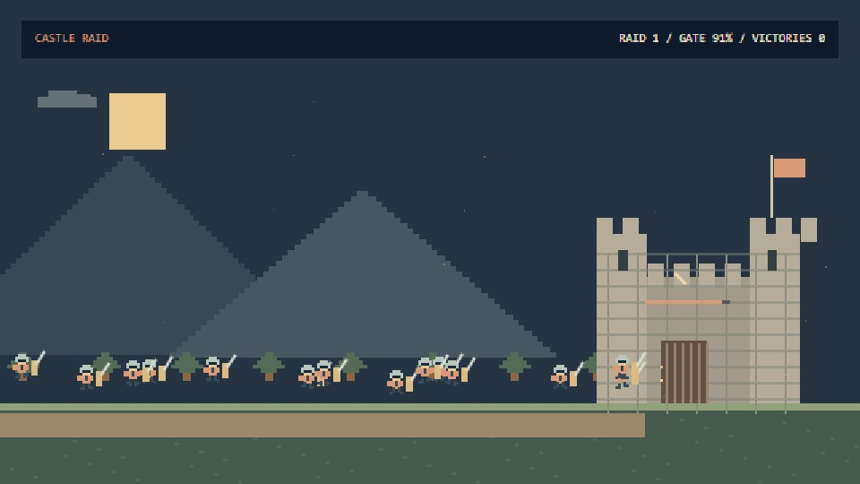 | **Castle Raid** Original tiny pixel knights march on a fortress, brave defensive arrows and break the gate. Each victory launches a fresh automatic raid. Procedural artwork, entirely offline. | Games | seeWallpaper | 1.0.0 |
| 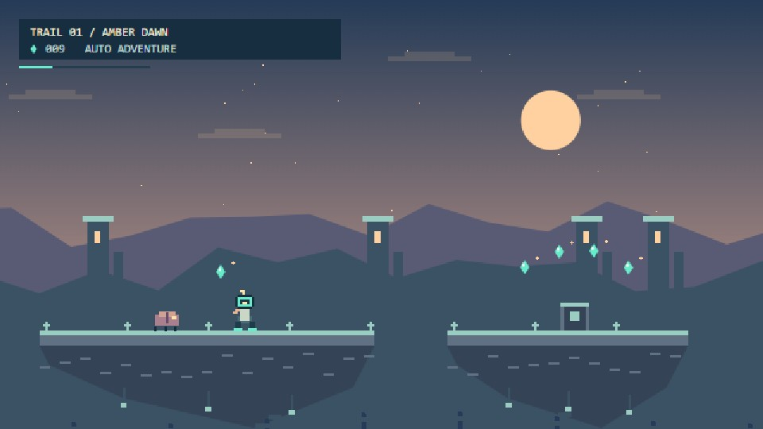 | **Crystal Run** An original pixel-art platform adventure that plays itself. A little explorer robot leaps between floating ruins, collects crystals, avoids clockwork beetles and reaches the beacon. New trails alternate between dawn, twilight and moonlight. Entirely procedural and offline. | Games | seeWallpaper | 1.0.0 |
| 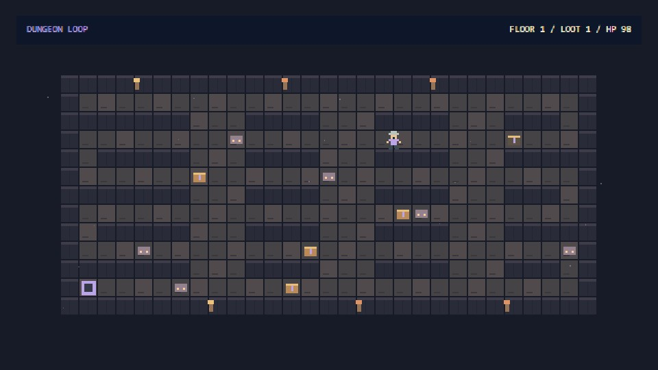 | **Dungeon Loop** An original adventurer automatically explores connected dungeon corridors, fights stone sentries, opens treasure chests and descends to the next floor. Procedural artwork, entirely offline. | Games | seeWallpaper | 1.0.0 |
| 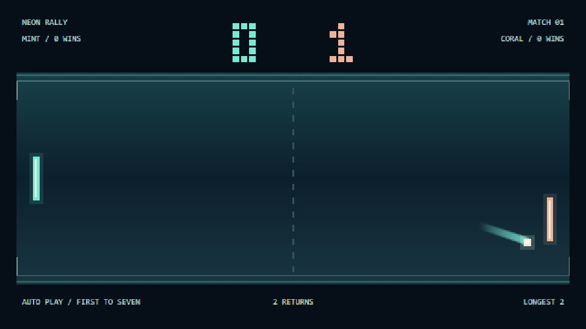 | **Neon Rally** A self-playing retro paddle duel with mint and coral opponents. Autopilots predict wall rebounds, react imperfectly, add spin and exchange accelerating rallies. Real scoring, first-to-seven matches and automatic restarts. Original procedural visuals, entirely offline. | Games | seeWallpaper | 1.0.0 |
| 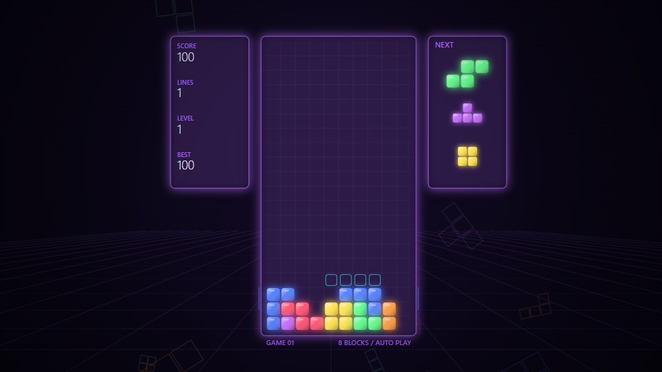 | **Neon Tetris** A neon falling-blocks game that plays itself: an AI places every piece, clears lines with particles, chains combos, levels up and starts a new game when it tops out. | Games | seeWallpaper | 1.1.0 |
| 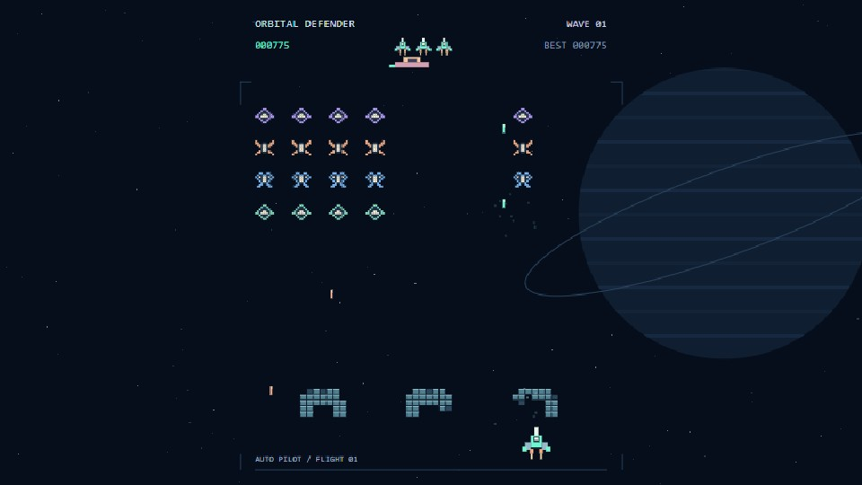 | **Orbital Defender** An original self-playing retro space shooter. An autopilot intercepts waves of geometric drones, dodges fire and defends an orbital outpost behind destructible shields. Includes scores, escalating waves and automatic game restarts. Original procedural pixel art, entirely offline. | Games | seeWallpaper | 1.0.0 |
| 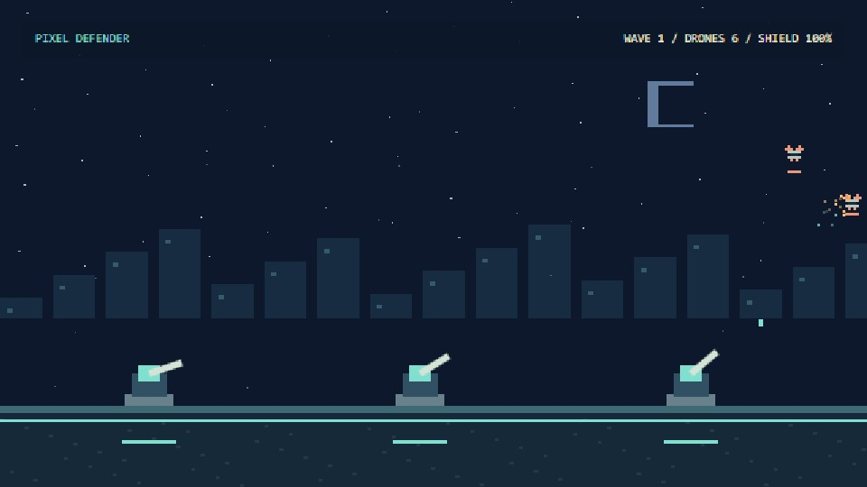 | **Pixel Defender** Futuristic turrets automatically track and intercept waves of drones over a pixel outpost. Guided shots, shield damage and endless escalating waves. Procedural artwork, entirely offline. | Games | seeWallpaper | 1.0.0 |
| 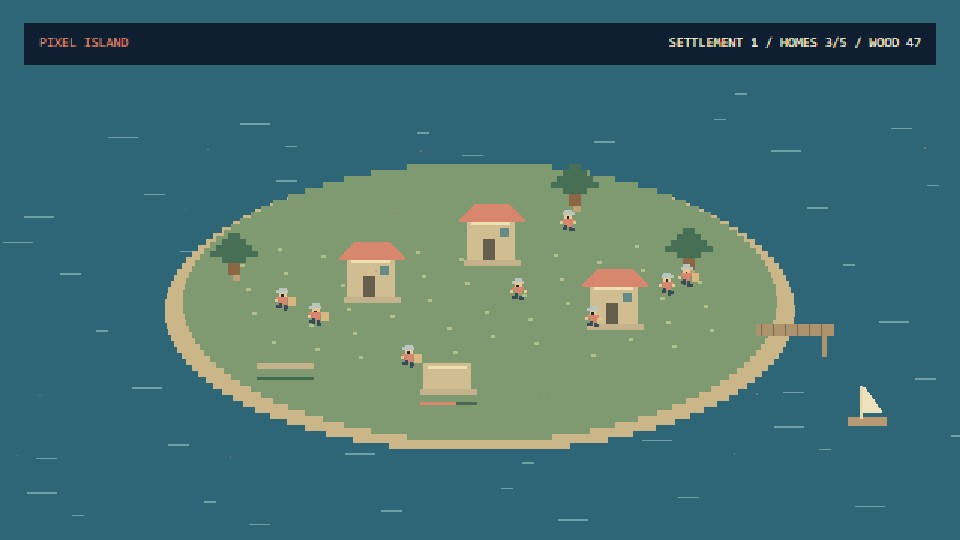 | **Pixel Island** Tiny island settlers gather wood and carry it to construction sites. Five homes rise from foundations, a sailboat circles the coast and settlement cycles repeat. Procedural artwork, entirely offline. | Games | seeWallpaper | 1.0.0 |
| 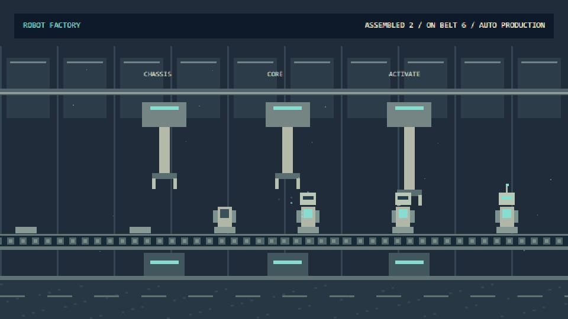 | **Robot Factory** A self-running robot assembly line. Mechanical stations fit chassis, install cores and activate robots on moving conveyor belts in continuous production. Procedural artwork, entirely offline. | Games | seeWallpaper | 1.0.0 |
| 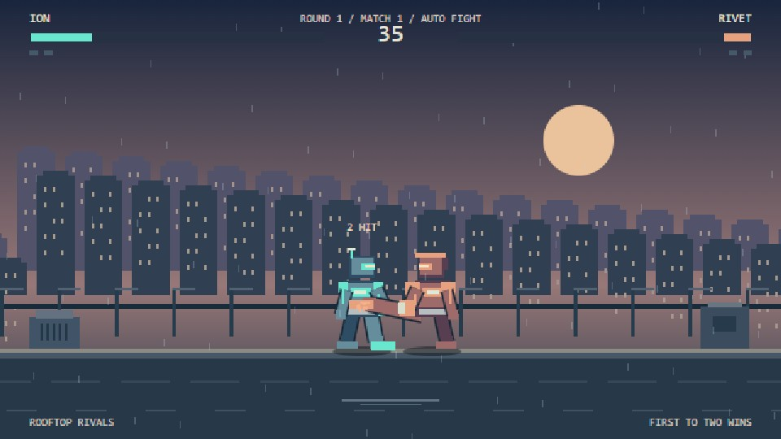 | **Rooftop Rivals** An original self-playing arcade robot fight on an industrial rooftop at dusk. Two autonomous fighters exchange punches, kicks, jumps, guards and energy pulses. Real health, combos, timed rounds and best-of-three matches restart automatically. Procedural pixel art, entirely offline. | Games | seeWallpaper | 1.0.0 |
| 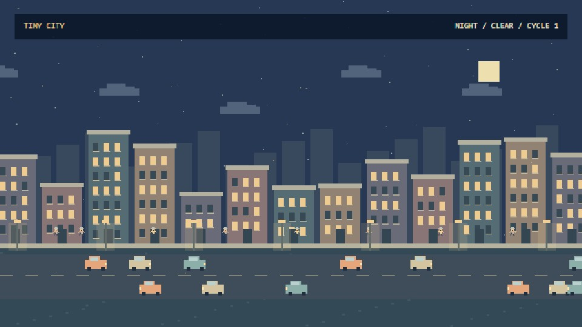 | **Tiny City** A living pixel city with two-way traffic, walking residents, illuminated windows, drifting clouds, rain and a continuous day/night cycle. Procedural artwork, entirely offline. | Games | seeWallpaper | 1.0.0 |
| 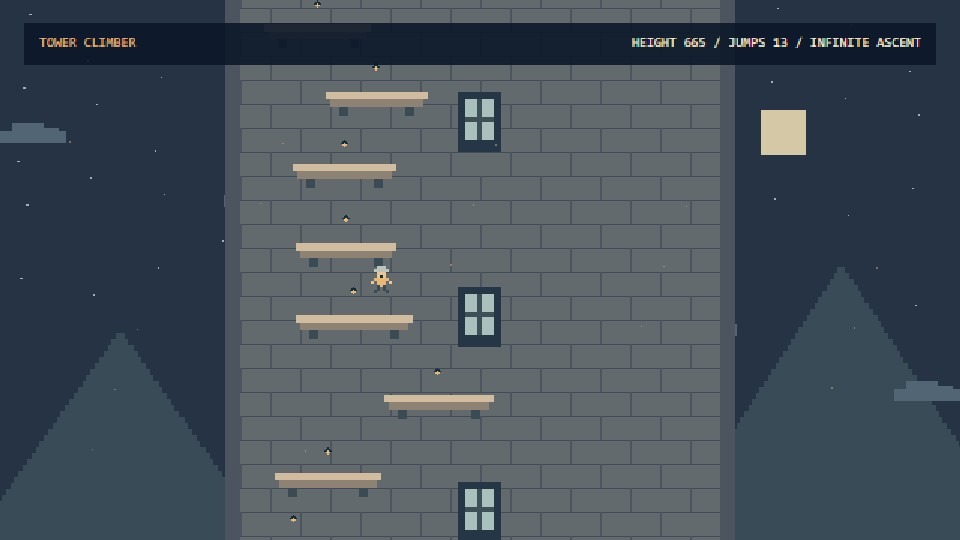 | **Tower Climber** An original pixel explorer automatically jumps between procedurally generated ledges on an endless tower. A scrolling camera follows the ascent with safe fall recovery. Procedural artwork, entirely offline. | Games | seeWallpaper | 1.0.0 |
| 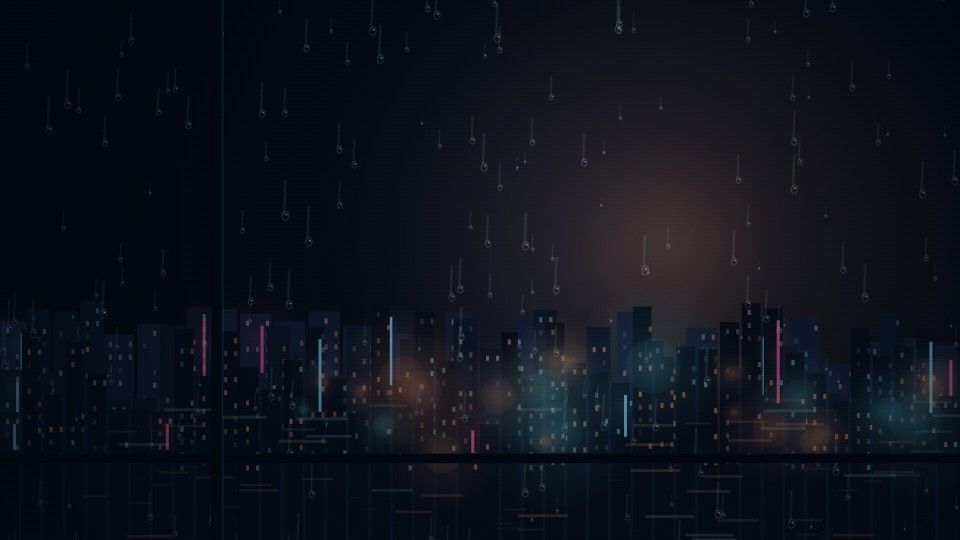 | **Rainy Window** A cinematic neon skyline through rain-streaked glass, with refracted droplets and city reflections. | Manga | seeWallpaper | 1.1.0 |
|  | **Sakura Night** A moonlit Japanese landscape with a branching cherry canopy, mountain silhouettes, a torii and drifting petals. | Manga | seeWallpaper | 1.1.0 |
|  | **Data Tunnel** An octagonal data tunnel with perspective, moving light trails and cyan / coral circuitry. | Matrix | seeWallpaper | 1.1.0 |
|  | **Digital Rain 3D** Matrix code rain in three depth planes with focus blur, mirrored glyphs that mutate as they fall, a clock revealed by the rain, CRT scanlines and occasional glitches. | Matrix | seeWallpaper | 2.0.0 |
| 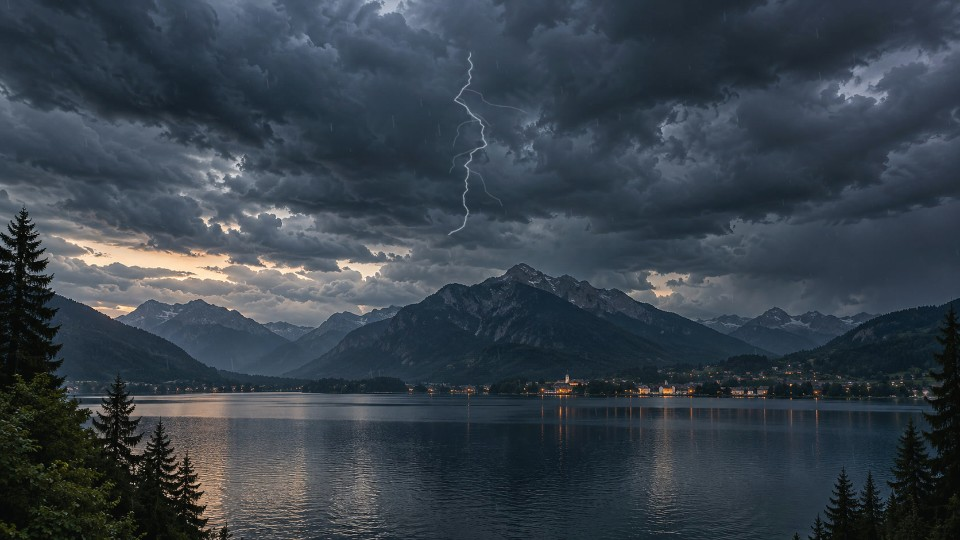 | **Alpine Thunderstorm** A photographic alpine lake beneath rolling storm clouds, with layered wind-driven rain, drifting moisture haze, lake ripples and occasional branched lightning illuminating the clouds and water. Original offline scenery with adjustable lightning frequency and flash brightness. | Nature | seeWallpaper | 1.0.0 |
| 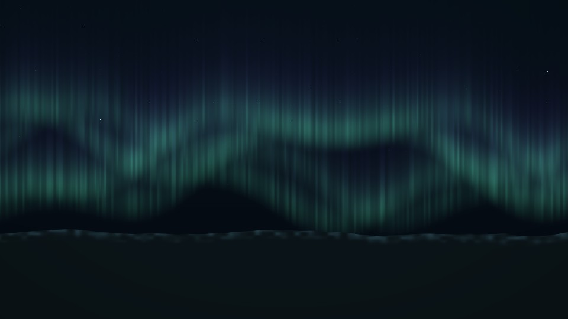 | **Aurora Borealis** Northern lights ripple above a silent mountain range and a crisp star field. | Nature | seeWallpaper | 1.0.0 |
|  | **Biker Road** A coastal motorcycle ride at sunset, with moving asphalt, drifting clouds, golden sea reflections, passing birds, exhaust smoke, roadside dust, moving sun rays and a pulsing tail light. Based on the supplied biker_road_wallpaper.svg artwork. | Nature | seeWallpaper | 1.2.0 |
| 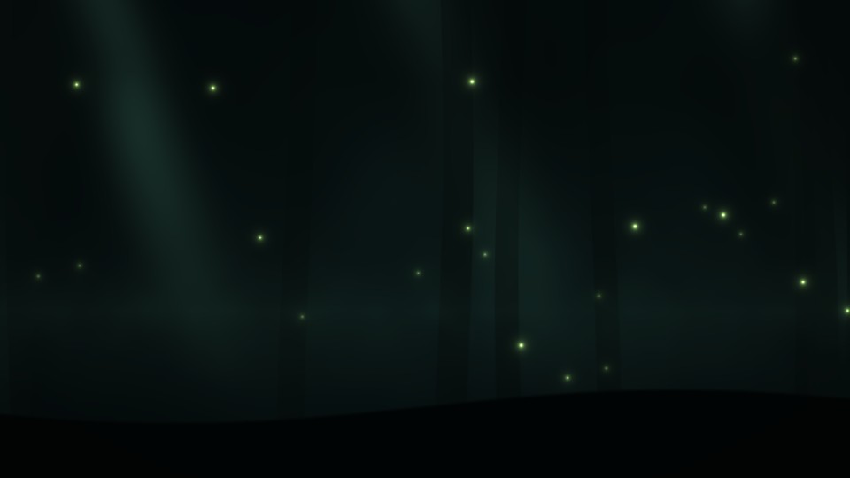 | **Firefly Grove** Fireflies drift between shadowed trees and soft shafts of light in a misty grove. | Nature | seeWallpaper | 1.0.0 |
| 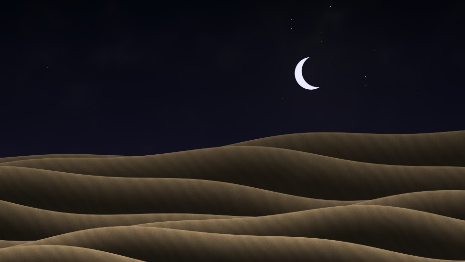 | **Moonlit Dunes** Sculpted dunes, wind-blown sand and a crescent moon in a quiet desert night. | Nature | seeWallpaper | 1.0.0 |
| 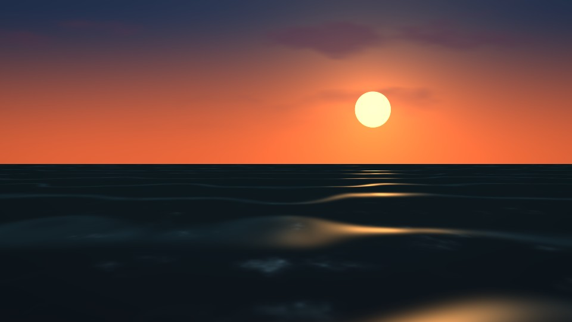 | **Ocean Dusk** A low sun, slowly rolling waves and a shimmering golden reflection across the ocean. | Nature | seeWallpaper | 1.0.0 |
|  | **Rain on Glass** Photographic blue-hour rain on a pane of glass: droplets settle, grow, merge and slide under gravity, leaving fading wet trails. Real-time refraction, curved reflections and tiny beads over an original city photograph. Entirely offline. | Nature | seeWallpaper | 1.0.0 |
| 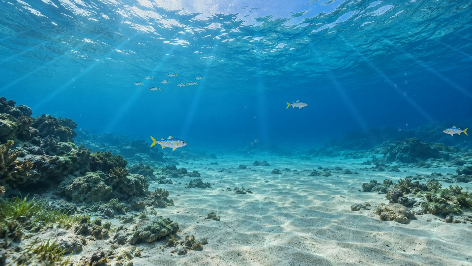 | **Underwater Blue** A living photographic underwater reef with swimming tropical fish, an animated distant shoal and rising bubble streams. Fish tails beat as they cross the scene; sun shafts, seabed light and current-borne particles add depth. Entirely offline. | Nature | seeWallpaper | 1.1.0 |
| 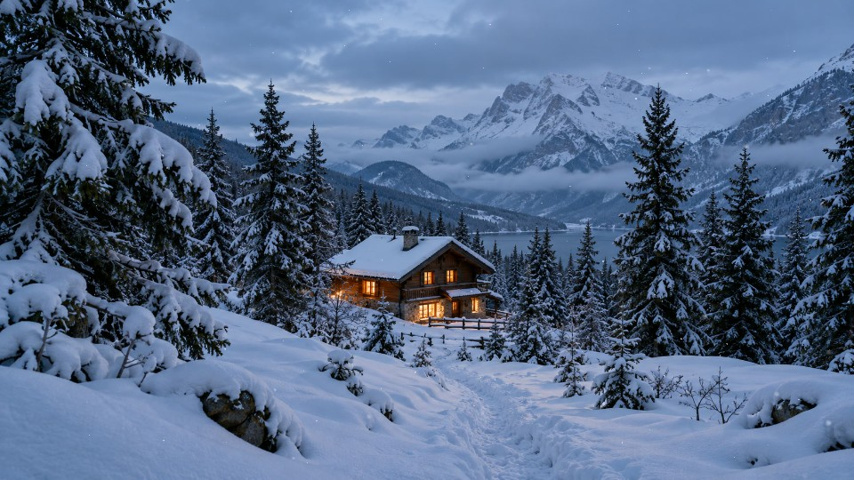 | **Winter Snowfall** Photographic snowfall in a quiet alpine forest at blue hour. Fine distant snow, drifting midground flakes and softly defocused foreground snow fall at different speeds with gentle wind gusts over an original snowy chalet photograph. Entirely offline. | Nature | seeWallpaper | 1.0.0 |
| 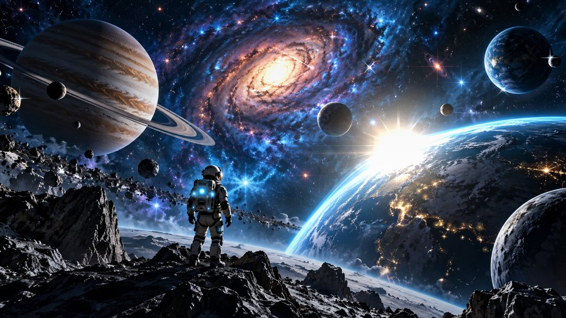 | **Astral Frontier** An astronaut on a rocky ridge facing a spiral galaxy, a ringed giant and a night-side Earth, with a sunrise flare, glowing atmosphere, twinkling city lights, drifting asteroids and shooting stars. | Space | seeWallpaper | 1.0.0 |
| 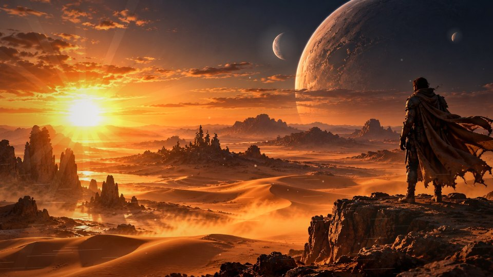 | **Desert Wanderer** A cloaked wanderer on a rocky ridge above an endless desert at sunset, with a cloak rippling in the wind, heat haze on the horizon, blowing sand, sun rays, a giant planet and an occasional worm sign in the dunes. | Space | seeWallpaper | 1.0.0 |
| 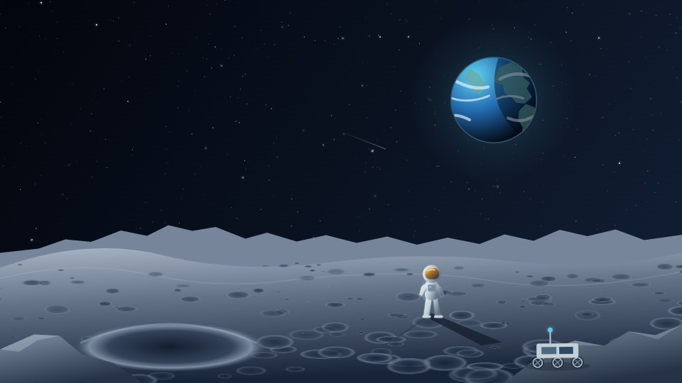 | **Lunar Silence** A lone astronaut on the lunar surface beneath a slowly turning blue Earth, with twinkling stars, shooting stars, a passing satellite and drifting moon dust. | Space | seeWallpaper | 1.0.0 |
| 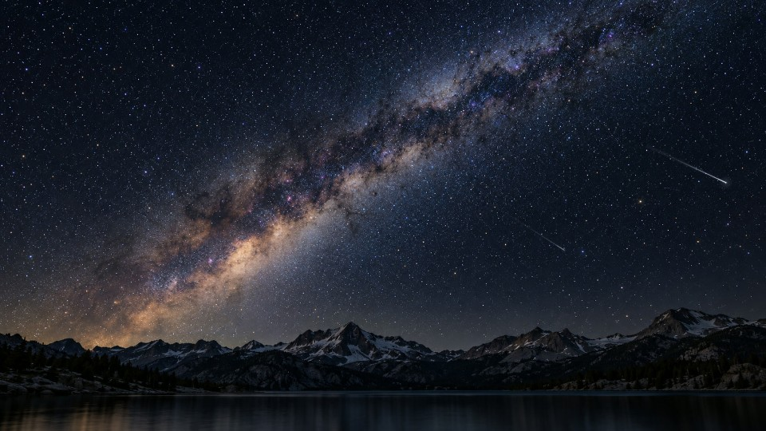 | **Meteor Shower** A photographic Milky Way above an alpine lake, crossed by a continuous automatic shower of shooting stars. Fine white-hot meteor heads, tapered luminous trails, subtle star scintillation and occasional brighter fireballs with fading atmospheric trains. Original offline artwork. | Space | seeWallpaper | 1.0.0 |
|  | **Orbital Earth** The Earth surrounded by satellites, with a sunrise on its limb, glowing atmosphere, twinkling city lights, orbiting satellites, radar pings and data links beamed down to the surface. | Space | seeWallpaper | 1.0.0 |
| 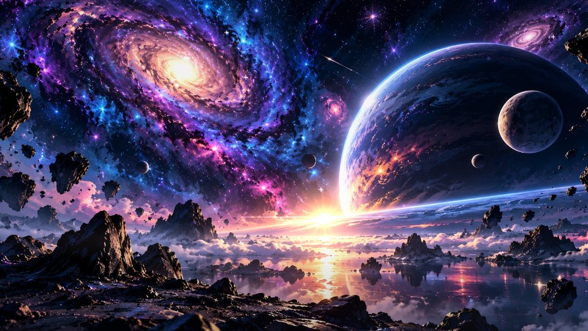 | **Pure Cosmos** A spiral galaxy and a giant ringed horizon over a mirror sea, with orbiting stars, shooting stars, a pulsing sunrise and drifting cosmic dust. | Space | seeWallpaper | 1.0.0 |
| 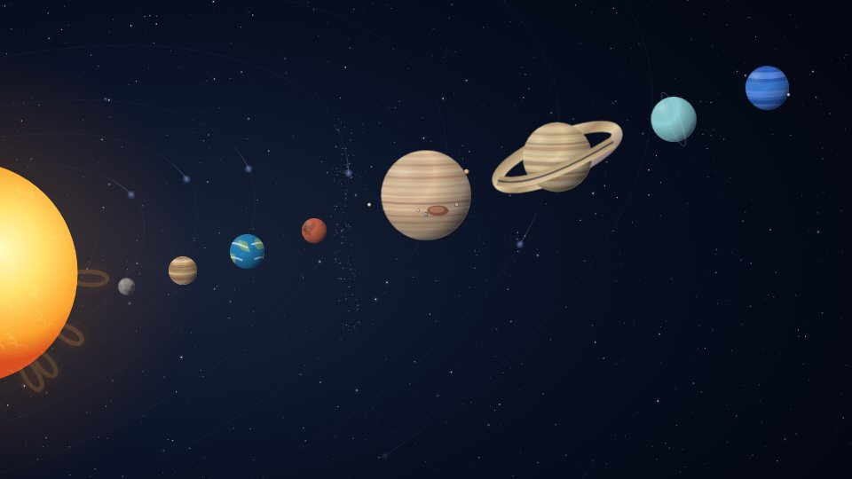 | **Solar System** The Sun and the eight planets in an artistic composition, with turning planets, orbiting moons, solar prominences, a drifting asteroid belt, orbit lights and a passing comet. | Space | seeWallpaper | 1.0.0 |
| 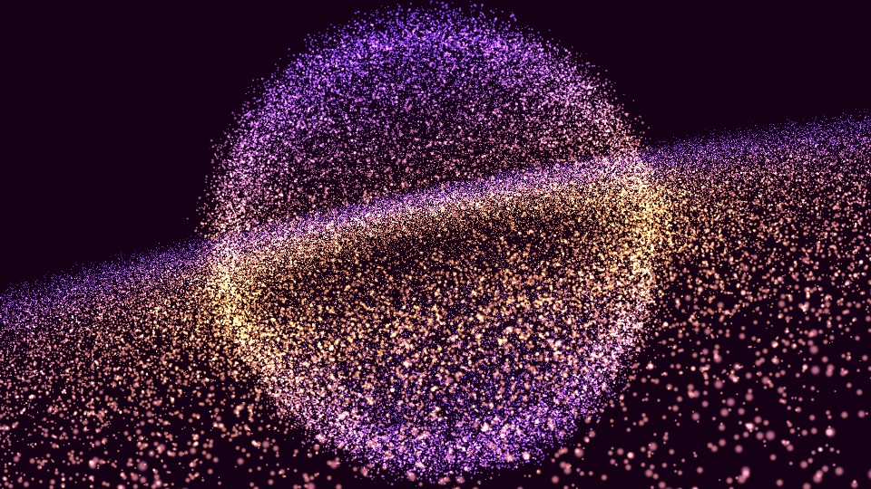 | **Stellar Drift** A golden particle sphere surrounded by a violet stardust disk, slowly rotating against deep plum space. No text or overlays. | Space | seeWallpaper | 1.0.0 |
|  | **AI Core** A holographic reactor with a rotating spherical lattice, orbital machinery and a pulsing energy core. | Tech | seeWallpaper | 1.1.0 |
| 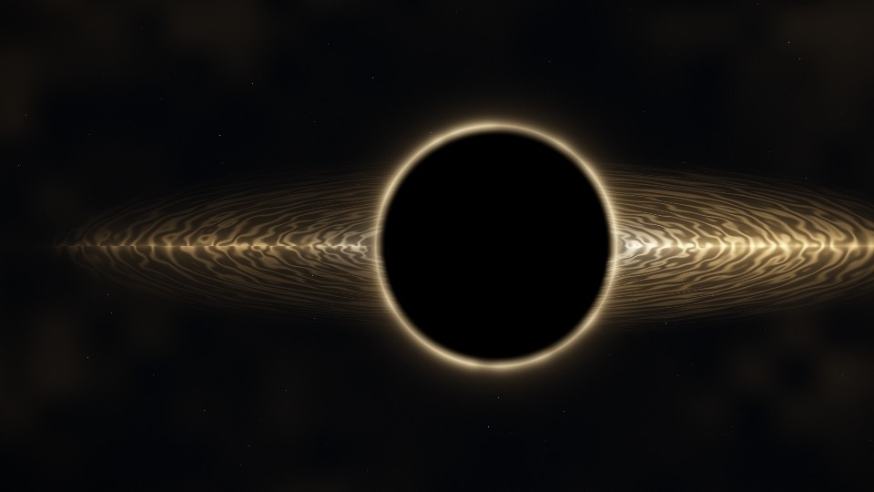 | **Event Horizon** A cinematic black hole with a turbulent accretion disk, gravitational lens artwork and a luminous photon ring. | Tech | seeWallpaper | 1.0.0 |
|  | **Neural Network** A rotating three-dimensional neural constellation with connected nodes and traveling synaptic pulses. | Tech | seeWallpaper | 1.1.0 |
| 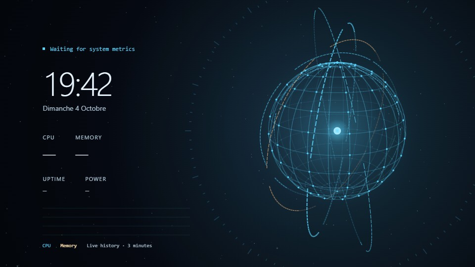 | **Operations Center** A holographic operations wallpaper with a live clock, real CPU / RAM history, uptime and power status. | Tech | seeWallpaper | 1.1.0 |
|  | **Particle Nexus** A particles.js wallpaper with drifting luminous nodes, fine proximity links and a quiet atmospheric background. Adjustable density, light color, movement, connection distance and optional pointer interaction. All library files are bundled for offline use. | Tech | seeWallpaper | 1.0.0 |
| 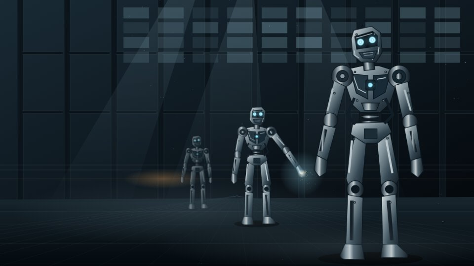 | **Robot Workshop** Three articulated robots in a quiet hangar: one keeps watch, one welds in a shower of sparks, one scans the hall, under flickering lights, drifting fog and floating dust. | Tech | seeWallpaper | 1.0.0 |
| 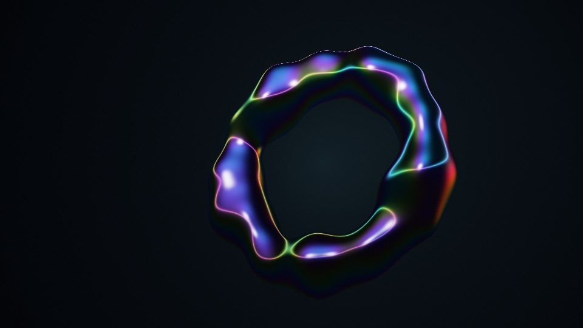 | **Spectral Forge** A ray-marched liquid-metal sculpture with iridescent chrome, rotating studio reflections and a slowly deforming surface. | Tech | seeWallpaper | 1.0.0 |
